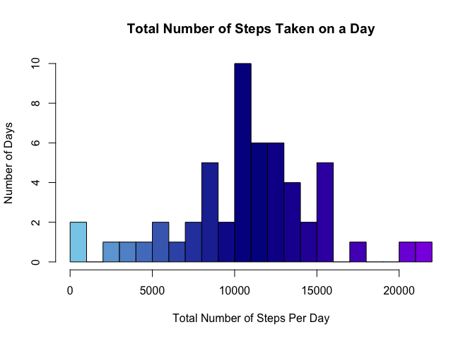
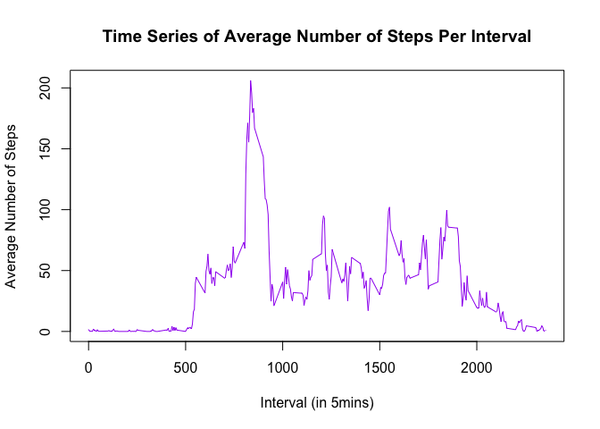
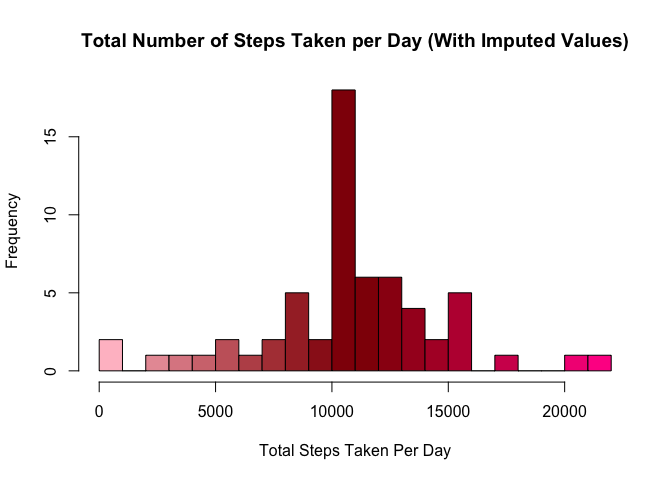
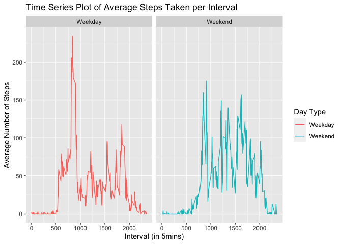

========================================

## Assignment Instructions

1. Provide a code for reading and processing the activity data

2. Create a histogram of the total number of steps taken each day

3. Compute for mean and median number of steps taken each day

4. Find the Time series plot of the average number of steps taken

5. The 5-minute interval that, on average, contains the maximum number of steps

6. Create a code to describe and show a strategy for imputing missing data

7. Generate the histogram of the total number of steps taken each day after missing values are imputed

8. Generate a panel plot which compares the average number of steps taken per 5-minute interval across weekdays and weekends

### Loading and preprocessing the Activity data
```{r, echo=TRUE}                     
path = getwd()
unzip("repdata_data_activity.zip", exdir = path)
act <- read.csv("activity.csv")
head(act)
summary(act)
```

### What is mean total number of steps taken per day?
1. Calculate the total number of steps taken per day
```{r, echo=TRUE} 
# In calculating the total number of steps taken per day, the data first needs to be grouped separately for each day, and then the sum of each group calculated.
TotalSteps<-aggregate(steps~date, act, sum)
```

2. Make a histogram of the total number of steps taken each day
```{r, echo=TRUE}  
paletteBlue <- colorRampPalette(c("skyblue", "darkblue", "blueviolet"))
hist(TotalSteps$steps, col = paletteBlue(22) ,breaks=20,  xlab="Total Number of Steps Per Day", ylab="Number of Days", main="Total Number of Steps Taken on a Day")
```
 

3. Calculate and report the mean and median of the total number of steps taken per day
```{r, echo=TRUE}  
TotalMean <-mean(TotalSteps$steps)
TotalMedian<-median(TotalSteps$steps)
cbind(TotalMean,TotalMedian)

```

### What is the average daily activity pattern?
1. Make a time series plot of the 5-minute interval (x-axis) and the average number of steps taken, averaged across all days (y-axis)
```{r, echo=TRUE} 
#Average Steps Taken
AveStepsInterval<-aggregate(steps~interval, act, mean)
with(AveStepsInterval, plot(interval, steps, type = "l", col = "purple", xlab = "Interval (in 5mins)", ylab = "Average Number of Steps"))
title("Time Series of Average Number of Steps Per Interval")
```
 

2. Which 5-minute interval, on average across all the days in the dataset, contains the maximum number of steps?
```{r, echo=TRUE} 
AveStepsInterval[grep(max(AveStepsInterval[,2]), AveStepsInterval[,2]), ]
```

### Imputing missing values
1. Calculate and report the total number of missing values in the dataset (i.e. the total number of rows with NAs)
```{r, echo=TRUE}
sum(is.na(act[,1]))
```
It can be seen that all 2304 NA values are contained within the steps variable.
A great imputing strategy is to utilize a usable numeric measurement, which in this case I chose to replace each NA with mean for same interval.

2. Devise a strategy for filling in all of the missing values in the dataset. The strategy does not need to be sophisticated. For example, you could use the mean/median for that day, or the mean for that 5-minute interval, etc.
```{r, echo=TRUE}
# Imputing missing values with the mean per interval
imputed <- act
for(x in 1:17568) {
    if(is.na(imputed[x, 1]) == TRUE) {
        imputed[x, 1] <- AveStepsInterval[AveStepsInterval$interval %in% imputed[x, 3], 2]
    }
}
head(imputed)
```

3. Create a new dataset that is equal to the original dataset but with the missing data filled in.
```{r, echo=TRUE}
imputedTotalStepsDay <- aggregate(steps ~ date, imputed, sum)
head(imputedTotalStepsDay)
```

4. Make a histogram of the total number of steps taken each day and Calculate and report the mean and median total number of steps taken per day. Do these values differ from the estimates from the first part of the assignment? What is the impact of imputing missing data on the estimates of the total daily number of steps?
```{r, echo=TRUE}
paletteR <- colorRampPalette(c("pink", "darkred", "deeppink"))
hist(imputedTotalStepsDay$steps, breaks=20, xlab="Total Steps Taken Per Day", 
     main="Total Number of Steps Taken per Day (With Imputed Values)", col=paletteR(22))
```
 

Calculating the mean and median total number of steps per day, we first find total number of steps per day.
```{r, echo=TRUE}
meanTotalSteps <- mean(imputedTotalStepsDay$steps) 
medianTotalSteps <- median(imputedTotalStepsDay$steps)
cbind(meanTotalSteps,medianTotalSteps)
```

### Are there differences in activity patterns between weekdays and weekends?
1. Create a new factor variable in the dataset with two levels – “weekday” and “weekend” indicating whether a given date is a weekday or weekend day.
```{r, echo=TRUE} 
# Updating format of the dates
act$date <- as.Date(strptime(act$date, format="%Y-%m-%d"))

# Create an ifelse for finding weekdays from weekends
act$dayType <- sapply(act$date, function(x) {
  if(weekdays(x) == "Saturday" | weekdays(x) == "Sunday")
  {y <- "Weekend"}
  else {y <- "Weekday"}
  y
})
```

2.Make a panel plot containing a time series plot (i.e. 𝚝𝚢𝚙𝚎 = “𝚕”) of the 5-minute interval (x-axis) and the average number of steps taken, averaged across all weekday days or weekend days (y-axis). See the README file in the GitHub repository to see an example of what this plot should look like using simulated data.
```{r, echo=TRUE} 
# Creating the data set that will be plotted
activity <-  aggregate(steps ~ interval + dayType, act, mean, na.rm = TRUE)

# Plotting using ggplot2
library(ggplot2)
Plot <-  ggplot(activity, aes(x = interval , y = steps, color = dayType)) + 
  geom_line() + ggtitle("Time Series Plot of Average Steps Taken per Interval") + 
  xlab("Interval (in 5 mins") + 
  ylab("Average Number of Steps") +
  facet_wrap(~dayType, ncol = 2, nrow=1) +
  scale_color_discrete(name = "Day Type")
print(Plot) 
```

 
